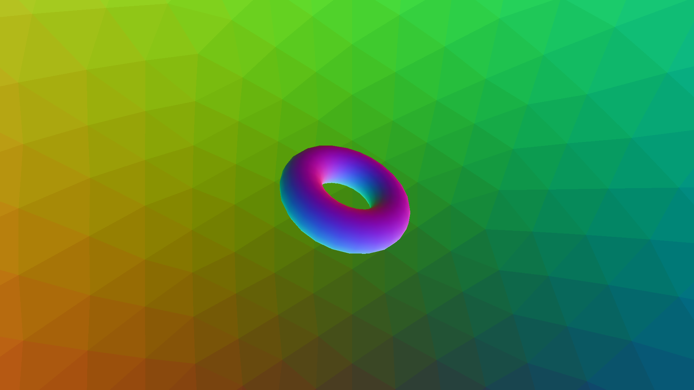

# Bitcamp 2024 Shaders in Three.js Workshop

Andy Qu  
*University of Maryland, College Park*  
*Department of Computer Science*

*In this workshop, students will learn about shaders and how they contribute to the underlying processes that make visualizing 3D games and simulations possible. This workshop covers the basics of creating scenes and shaders using the popular JavaScript library, Three.js. Hopefully this workshop can be a good starting point for students to then be able to create lighting systems/shading techniques and explore the various visual effects achievable.*

## Setting Up

### Prerequisites
Modern versions of web browsers will not allow us to run local JavaScript files for safety. To circumnavigate this:
- **Mozilla Firefox**: go to `about:config` and change the `security.fileuri.strict_origin_policy` value to `false`
- **Google Chrome**: run Chrome using `C:\PATH TO\chrome.exe --allow-file-access --allow-file-access-from-files`

### Instructions
Each of the top-level directories prepended with the prefix ThreeJS contains a runnable Three.js world. To run them, simply run the `index.html` file on Firefox.

During the workshop, please open the `ThreeJS_Normal_Shader_Demo` folder and follow along with the files in there.

## Acknowledgements

### Special Thanks
- Bitcamp 2024 Team
  - Workshop Organizing Team
  - Beatrice Chung
  - Anjali Samavedam
  - Saanvi Kataria
  - And many others for making this possible...
- Prof. Matthias Zwicker (My Advisor)
- Shuhong Chen
### Credits
- [Anime Shaders](https://github.com/ShuhongChen/anime-shaders)
- [Simon's Basic Three.js Tutorial](https://github.com/simondevyoutube/ThreeJS_Tutorial_BasicWorld)
- CMSC398K: Special Topics in Computer Science; Basic Shaders in Three.js
  - [Lecture Recordings](https://umd.hosted.panopto.com/Panopto/Pages/Sessions/List.aspx#folderQuery=%22CMSC398K%22&folderID=%2245d7286c-21f9-4e21-8c27-af5e01393f1a%22)